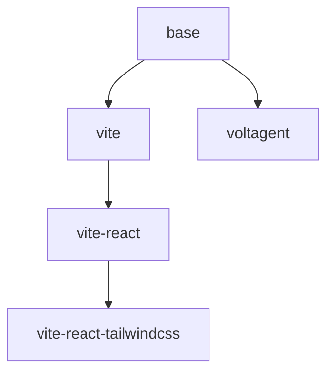

# bun-templates

Dev Container-ready Bun templates are here! ☺️

## Requirements

```bash
scaffold() {
    local template="$1"
    local name="$2"
    npx tiged "$template" "$name"
    find "$name" -type f | xargs sed -i "s/unique-name/$name/g"
    find "$name" | xargs rename "s/unique-name/$name/g" "$name"
}
```

## base

```bash
scaffold sakkeam/bun-templates/base my-unique-name
```

## vite

```bash
scaffold sakkeam/bun-templates/vite my-unique-name
```

## vite-react

```bash
scaffold sakkeam/bun-templates/vite-react my-unique-name
```

## vite-react-tailwindcss

```bash
scaffold sakkeam/bun-templates/vite-react-tailwindcss my-unique-name
```

## voltagent

```bash
scaffold sakkeam/bun-templates/voltagent my-unique-name
```

## Dependency Graph


